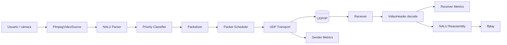
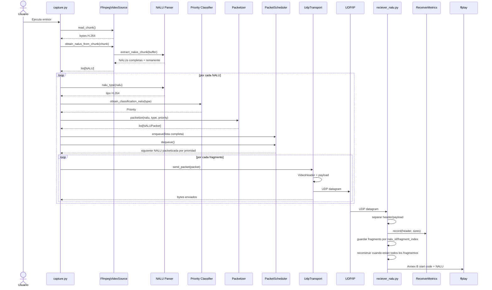

# Handoff técnico — Prototipo H.264 sobre UDP (Python → C++)

## 1. Objetivo del prototipo

Este repositorio implementa un **baseline experimental de transmisión de video H.264 en tiempo real sobre UDP**. Su propósito actual no es ser el protocolo final, sino servir como referencia funcional y medible para:

- validar captura y codificación H.264;
- extraer NALUs Annex B;
- clasificar NALUs por prioridad;
- fragmentar NALUs en datagramas pequeños;
- transportar los fragmentos por UDP;
- reconstruir NALUs en el receptor;
- reproducir el flujo con `ffplay`;
- registrar métricas del emisor y receptor;
- servir como base de comparación para una implementación equivalente en C++.

La arquitectura está deliberadamente separada para que UDP pueda sustituirse más adelante por otro transporte sin reescribir parsing, packetización o clasificación.

---

## 2. Arquitectura general



### Flujo lógico

```text
Cámara
→ FFmpeg/libx264
→ stream H.264 Annex B
→ chunks de bytes
→ NALUs completas
→ clasificación de prioridad
→ fragmentación
→ NALUPacket
→ scheduler
→ VideoHeader + payload
→ UDP
→ deserialización del header
→ reconstrucción de NALUs
→ ffplay
```

---

## 3. Secuencia completa de una transmisión



---

## 4. Responsabilidad de cada archivo

### Raíz

#### `capture.py`
Orquestador del emisor. No implementa directamente socket, parsing ni fragmentación: coordina los componentes.

Responsabilidades:
- leer chunks desde `FfmpegVideoSource`;
- obtener NALUs completas;
- obtener tipo y prioridad;
- solicitar packetización;
- encolar en el scheduler;
- enviar mediante `UdpTransport`;
- registrar métricas de envío.

#### `ffmpeg_video_source.py`
Encapsula el proceso FFmpeg y el buffer de entrada H.264.

Entrada:
```text
/dev/video0
```

Salida:
```text
list[bytes]  # NALUs completas
```

Configuración actual de FFmpeg:
- `v4l2`;
- `libx264`;
- `ultrafast`;
- `zerolatency`;
- salida H.264 cruda por `stdout`.

#### `config.py`
Centraliza configuración compartida:
- IP y puerto;
- tamaño de lectura;
- tamaño seguro de datagrama (`1200` bytes);
- tamaño real del header;
- máximo payload por fragmento;
- mapeo inicial de tipos NALU a prioridades;
- `DEBUG`.

#### `reciever_nalu.py`
Orquestador del receptor.

Responsabilidades:
- abrir socket UDP;
- recibir datagramas;
- separar header y payload;
- registrar métricas;
- mantener NALUs pendientes agrupadas por `nalu_id`;
- almacenar cada fragmento por `fragment_index`;
- reconstruir una NALU cuando se han recibido todos sus fragmentos;
- alimentar `ffplay`;
- guardar `reconstructed2` para depuración.

El reensamblado ya no depende de que los fragmentos de una misma NALU lleguen consecutivamente. La estructura actual es conceptualmente:

```text
pending_nalus[nalu_id]
├── fragment_count
└── fragments[fragment_index] = payload
```

Cuando `len(fragments) == fragment_count`, los fragmentos se concatenan en orden de índice y la entrada pendiente se elimina.

---

### `packets/`

#### `nalu_parser.py`
Parser H.264 Annex B.

Funciones principales:
- detectar start codes de 3 y 4 bytes;
- extraer NALUs completas;
- conservar el último fragmento incompleto en el buffer;
- recuperar tipo H.264 mediante `byte[0] & 0x1F`;
- mapear tipos comunes a nombres.

Tipos relevantes:

| Tipo | Significado |
|---:|---|
| 1 | non-IDR slice |
| 5 | IDR slice |
| 6 | SEI |
| 7 | SPS |
| 8 | PPS |

#### `priority_classifier.py`
Convierte el tipo NALU a prioridad lógica.

| NALU | Prioridad |
|---|---|
| SPS / PPS | CRITICAL |
| IDR | HIGH |
| non-IDR | NORMAL |
| SEI | LOW |
| desconocido | NORMAL |

La prioridad describe **importancia lógica**, no un transporte específico.

#### `packetizer.py`
Fragmenta cada NALU según:

```text
SIZE_MAX_PACKET = 1200 - HEADER_SIZE
```

Mantiene dos estados persistentes:
- `packet_sequence` global;
- `nalu_id` global.

Cada fragmento se representa con `NALUPacket`.

#### `packetScheduler.py`
Scheduler de prioridad estricta.

Mantiene una `deque` por prioridad, donde cada elemento es una **lista completa de fragmentos pertenecientes a una NALU**:

```text
deque[list[NALUPacket]]
```

Orden actual:

```text
CRITICAL → HIGH → NORMAL → LOW
```

FIFO se conserva dentro de cada prioridad.

---

### `transport/`

#### `transport.py`
Contrato abstracto del transporte:

```text
send_packet(packet) -> int
close() -> None
```

Permite sustituir UDP posteriormente sin modificar el resto del pipeline.

#### `udp_transport.py`
Implementación UDP.

Por cada `NALUPacket`:
1. construye `VideoHeader`;
2. serializa el header;
3. concatena header + payload;
4. valida que no supere 1200 bytes;
5. llama `sendto()`;
6. devuelve el tamaño enviado para métricas.

#### `video_header.py`
Header binario custom de **24 bytes**.

Formato:

```text
!IIHHBBQH
```

| Campo | Tamaño |
|---|---:|
| packet_sequence | 4 B |
| nalu_id | 4 B |
| fragment_index | 2 B |
| fragment_count | 2 B |
| nal_type | 1 B |
| priority | 1 B |
| timestamp_ns | 8 B |
| payload_size | 2 B |
| **Total** | **24 B** |

Todos los campos usan byte order de red (`!`, big-endian).

Este header **no es RTP**.

---

### `metrics/`

#### `sender_metrics.py`
Registra:
- paquetes enviados;
- NALUs enviadas;
- paquetes pertenecientes a NALUs fragmentadas;
- payload total;
- bytes de aplicación totales (`header + payload`);
- bitrate de payload;
- bitrate de aplicación;
- distribución por prioridad;
- distribución por tipo NALU.

#### `reciever_metrics.py`
Intenta registrar:
- paquetes recibidos;
- bytes payload / aplicación;
- bitrate;
- paquetes únicos;
- duplicados;
- fuera de orden;
- reconstrucción/incompletitud de NALUs;
- distribución por prioridad y tipo.

**Importante:** esta clase necesita correcciones antes de usarse como referencia numérica para la comparación Python ↔ C++ (ver sección 8).

---

### `test/`

#### `test_scheduler.py`
Prueba manual para validar el orden de prioridad del scheduler.

Debe evolucionar a una prueba sin red, verificando directamente el orden devuelto por `dequeue()`.

---

## 5. Modelo de datos principal

### `NALUPacket`

Objeto interno. No viaja directamente por red.

```text
NALUPacket
├── packet_sequence
├── nalu_id
├── fragment_index
├── fragment_count
├── nal_type
├── priority
├── timestamp_ns
└── payload
```

### Relación NALU → fragmentos

Ejemplo para una NALU de 2500 bytes con payload máximo 1176:

```text
NALU id=42
├── packet_sequence=100, fragment=0/3, payload=1176
├── packet_sequence=101, fragment=1/3, payload=1176
└── packet_sequence=102, fragment=2/3, payload=148
```

Todos comparten:
- `nalu_id`;
- `fragment_count`;
- `nal_type`;
- `priority`;
- `timestamp_ns`.

---

## 6. Mapeo recomendado Python → C++

| Python | C++ sugerido |
|---|---|
| `bytes` / `bytearray` | `std::vector<std::uint8_t>` |
| `dataclass NALUPacket` | `struct NaluPacket` |
| `IntEnum Priority` | `enum class Priority : uint8_t` |
| `deque[list[NALUPacket]]` | `std::deque<std::vector<NaluPacket>>` |
| `set[int]` | `std::unordered_set<uint32_t>` |
| `dict` de métricas | `std::array`, `std::unordered_map` o struct de contadores |
| `time.monotonic_ns()` | `std::chrono::steady_clock` |
| `struct.pack/unpack` | serialización explícita campo a campo / helpers endian |
| `socket.sendto/recvfrom` | POSIX sockets o wrapper de red |
| `subprocess.Popen` | `popen`, `fork/exec`, pipe o integración directa FFmpeg/libav* |
| ABC `Transport` | interfaz con métodos virtuales puros |

### Interfaces C++ mínimas

```cpp
struct NaluPacket;

class Transport {
public:
    virtual std::size_t sendPacket(const NaluPacket& packet) = 0;
    virtual void close() = 0;
    virtual ~Transport() = default;
};
```

Para el packetizer:

```cpp
class Packetizer {
public:
    std::vector<NaluPacket> packetize(
        const std::vector<std::uint8_t>& nalu,
        std::uint8_t naluType,
        Priority priority
    );

private:
    std::uint32_t packetSequence_{0};
    std::uint32_t naluId_{0};
};
```

---

## 7. Comparativa Python vs C++

Para que la comparación sea válida, ambas versiones deben usar exactamente:

- misma cámara / video de entrada;
- misma configuración de FFmpeg y codec;
- mismo header de 24 bytes;
- mismo límite de 1200 bytes;
- misma política de prioridades;
- misma lógica de fragmentación;
- misma duración de prueba;
- mismo equipo o hardware equivalente;
- mismo receptor cuando se compare únicamente el emisor, y viceversa.

### Métricas mínimas

#### Red / protocolo
- `packets_sent` / `packets_received`;
- `payload_bytes`;
- `wire_bytes` de aplicación;
- `payload_bitrate`;
- `wire_bitrate`;
- overhead porcentual;
- paquetes por prioridad;
- paquetes por tipo;
- duplicados;
- fuera de orden;
- pérdidas / huecos confirmados.

#### Rendimiento de implementación
- CPU promedio y pico;
- RAM promedio y pico;
- tiempo de packetización por NALU;
- tiempo de serialización por paquete;
- tiempo de envío;
- latencia extremo a extremo cuando exista sincronización válida;
- jitter.

### Formato sugerido para exportación

Para evitar comparar logs de consola, ambas implementaciones deberían poder producir CSV o JSON:

```text
implementation,language,duration_s,packets_sent,payload_bytes,wire_bytes,payload_mbps,wire_mbps,cpu_avg,ram_mb
python,Python,...
cpp,C++,...
```

---

## 8. Correcciones y limitaciones actuales antes de congelar el baseline

Las siguientes observaciones reflejan el estado posterior a las correcciones de cierre de FFmpeg, cálculo de diferencias y reensamblado por `nalu_id`.

### RESUELTO

#### 8.1 Cierre de `FfmpegVideoSource`
El problema previo donde se referenciaba `source.close` sin ejecutarlo fue corregido usando `source.close()`.

#### 8.2 Error aritmético en `RecieverMetrics.calculate_differences()`
El cálculo que restaba `temp_total_nalu_count - temp_total_nalu_count` fue corregido.

#### 8.3 Reensamblado de fragmentos no consecutivos
El receptor ya no usa un único `nalu_temp`. Ahora mantiene un diccionario de NALUs pendientes por `nalu_id`, y dentro de cada una guarda los payloads por `fragment_index`.

Esto permite recibir, por ejemplo:

```text
NALU 10 / fragmento 0
NALU 11 / fragmento 0
NALU 10 / fragmento 1
```

sin mezclar los fragmentos.

---

### PRIORIDAD ALTA

#### 8.4 `RecieverMetrics` todavía debe alinearse con el nuevo reensamblador
Aunque `reciever_nalu.py` ya soporta fragmentos intercalados por `nalu_id`, la lógica de métricas previamente revisada conserva estado temporal basado en un único `temp_nalu_actual_id`.

Para medir correctamente NALUs completas/incompletas bajo reordenamiento, las métricas deberían recibir eventos del reensamblador (`complete_nalu`, `incomplete_nalu`) o mantener una estructura equivalente por `nalu_id`.

#### 8.5 Falta política de expiración para NALUs incompletas
Una NALU que pierde definitivamente un fragmento permanece en `pending_nalus` indefinidamente mientras siga activa la recepción.

Se necesita posteriormente una política como:
- timeout por antigüedad;
- límite de NALUs pendientes;
- descarte al avanzar demasiado el `nalu_id`;
- limpieza explícita al finalizar la sesión.

Esto también permitirá contabilizar `nalu_incompletes` de forma fiable.

#### 8.6 El orden de salida entre NALUs todavía puede alterarse
El nuevo reensamblador conserva el orden de los **fragmentos dentro de cada NALU**, pero entrega una NALU a `ffplay` tan pronto como queda completa.

Si una NALU posterior termina antes que una anterior:

```text
NALU 10: falta fragmento 1
NALU 11: completa
```

la NALU 11 puede entregarse primero y la 10 después. Para soportar reordenamiento arbitrario sin alterar el bitstream H.264 hará falta un pequeño buffer de salida basado en el siguiente `nalu_id` esperado, junto con una política de timeout/descarte para no bloquear eternamente.

Para el baseline local actual puede documentarse como limitación.

#### 8.7 Duplicados y fuera de orden deben separarse en métricas
La lógica de métricas debe comprobar primero si una secuencia ya fue recibida.

Política recomendada:
1. si `packet_sequence` ya está en el conjunto, contar duplicado;
2. si no es duplicado y es menor que `highest_sequence_seen`, contar fuera de orden;
3. si es mayor, actualizar `highest_sequence_seen`.

Un duplicado antiguo no debería incrementar simultáneamente la métrica de fuera de orden.

### PRIORIDAD MEDIA

#### 8.8 Validar metadatos de fragmentación
Antes de almacenar un fragmento conviene validar al menos:

```text
0 <= fragment_index < fragment_count
fragment_count > 0
payload_size == len(payload recibido)
```

También conviene comprobar que todos los fragmentos asociados al mismo `nalu_id` anuncien el mismo `fragment_count`.

Esto evita que un datagrama corrupto o mal formado deje estado imposible de reconstruir.

#### 8.9 `total_nalus` del receptor debe representar la semántica elegida
La métrica debe aclarar si cuenta:
- toda NALU observada;
- solo NALUs fragmentadas;
- o NALUs reconstruidas correctamente.

Para comparaciones Python ↔ C++, conviene que `total_nalus` incluya también NALUs de un solo fragmento y usar métricas separadas para NALUs fragmentadas.

#### 8.10 `sender_nalu.py` es código histórico
Puede moverse a `legacy/` o eliminarse una vez confirmada su inutilidad para evitar confundir el port a C++.

---

## 9. Contrato de reensamblado para el port a C++

La implementación C++ debe conservar, como mínimo, estas reglas del receptor Python actual:

```text
clave de agrupación = nalu_id
clave de fragmento = fragment_index
cantidad esperada = fragment_count
NALU completa = todos los índices [0, fragment_count)
```

Representación conceptual en C++:

```cpp
struct PendingNalu {
    std::uint16_t fragmentCount;
    std::unordered_map<std::uint16_t, std::vector<std::uint8_t>> fragments;
};

std::unordered_map<std::uint32_t, PendingNalu> pendingNalus;
```

No es obligatorio usar exactamente estas estructuras; lo importante para la comparación es mantener la misma semántica.

### Invariantes útiles

```text
cada fragment_index aparece como máximo una vez por nalu_id
una NALU solo se reconstruye cuando están todos sus índices
los fragmentos se concatenan en orden de fragment_index
una NALU reconstruida se elimina de pending_nalus
un datagrama inválido no debe contaminar el estado pendiente
```

---

## 10. Pruebas mínimas específicas del reensamblador

Antes de comparar rendimiento Python/C++, ambas implementaciones deberían pasar los mismos vectores de prueba:

```text
Caso A — orden normal
10:0, 10:1, 10:2
→ reconstruye NALU 10

Caso B — fragmentos desordenados
10:2, 10:0, 10:1
→ reconstruye NALU 10 en orden 0,1,2

Caso C — NALUs intercaladas
10:0, 11:0, 10:1, 11:1
→ reconstruye ambas sin mezclar payloads

Caso D — duplicado
10:0, 10:0, 10:1
→ no duplica contenido

Caso E — fragmento perdido
10:0, 10:2
→ permanece pendiente hasta política de descarte/timeout

Caso F — NALU posterior completa antes
10:0, 11:0, 11:1, 10:1
→ permite observar y decidir la política de orden de salida entre NALUs
```

Estos casos son especialmente útiles para validar interoperabilidad Python ↔ C++ sin depender de cámara, FFmpeg o red real.

