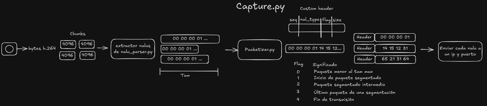
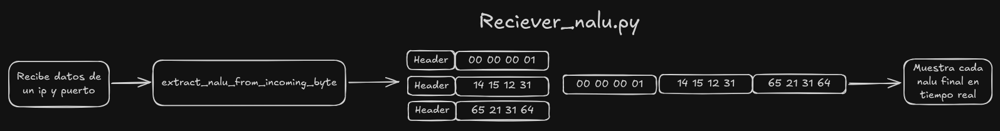

# H.264 NALU Streaming over UDP

Este proyecto es una prueba experimental para transmitir video H.264 en tiempo real usando UDP.

La idea principal es tomar video desde una cámara, codificarlo como H.264, separar el flujo en NALUs, dividir las NALUs grandes en paquetes pequeños, enviarlas por UDP y reconstruirlas del lado del receptor para visualizarlas con `ffplay`.

No es todavía el protocolo final del proyecto. Esta versión funciona como una base práctica para entender y validar el envío de video comprimido por UDP.

---

## Flujo general

```text
Cámara
  ↓
FFmpeg
  ↓
H.264 raw stream
  ↓
Chunks de bytes
  ↓
Parser de NALUs
  ↓
Packetizer
  ↓
UDP sender
  ↓
UDP receiver
  ↓
Reconstructor de NALUs
  ↓
ffplay
  ↓
Video en vivo
```

---

## Instalación de paquetes

### Fedora / Linux

Instalar FFmpeg y herramientas básicas:

```bash
sudo dnf install ffmpeg ffmpeg-devel v4l-utils python3 python3-pip
```

Si `ffplay` no queda disponible con el paquete anterior, revisar que FFmpeg esté instalado correctamente:

```bash
ffmpeg -version
ffplay -version
```

Para revisar qué cámaras detecta Linux:

```bash
ls /dev/video*
v4l2-ctl --list-devices
```

Este proyecto asume por defecto que la cámara está en:

```text
/dev/video0
```

Si tu cámara aparece en otro dispositivo, cambia esa ruta en `capture.py`.

### Entorno virtual opcional

Crear entorno virtual:

```bash
python3 -m venv .venv
source .venv/bin/activate
```

Instalar dependencias de Python:

```bash
pip install opencv-python
```

Nota: `opencv-python` solo es necesario si se mantiene alguna parte del código que use `cv2`. Si el video se visualiza únicamente con `ffplay`, puede no ser indispensable.

---

## Archivos principales

### `capture.py`

Es el punto de entrada del emisor.

Este archivo abre la cámara usando FFmpeg, codifica el video en H.264 y lee el stream generado desde `stdout`.

Después toma los bytes recibidos por chunks, extrae NALUs completas, las packetiza y las manda por UDP.

En pocas palabras:

```text
cámara → H.264 → NALUs → paquetes UDP
```



---

### `nalu_parser.py`

Se encarga de trabajar con el formato H.264 Annex B.

Busca los start codes:

```text
00 00 01
00 00 00 01
```

y usa esos separadores para encontrar las NALUs dentro del stream.

También permite obtener el tipo de NALU:

```text
1 = non-IDR slice
5 = IDR slice
6 = SEI
7 = SPS
8 = PPS
```

---

### `packetizer.py`

Se encarga de dividir una NALU grande en fragmentos más pequeños para poder mandarlos por UDP sin pasarnos del tamaño recomendado.

Cada fragmento se guarda como un `NALUPacket`, que contiene:

```text
payload
sequence
nal_type
flag
size
```

Las flags usadas son:

```text
0 = NALU completa en un solo paquete
1 = inicio de NALU fragmentada
2 = fragmento intermedio
3 = final de NALU fragmentada
4 = fin de transmisión
```

---

### `simple_rtp_header.py`

Define un header binario custom de 8 bytes.

Aunque el archivo se llama `SimpleRtp`, este proyecto no implementa RTP real. El nombre quedó como referencia histórica de las pruebas anteriores.

El header contiene:

```text
sequence      4 bytes
nal_type      1 byte
flags         1 byte
payload_size  2 bytes
```

Formato total:

```text
[ header custom ][ payload ]
```

---

### `sender_nalu.py`

Contiene funciones auxiliares para crear el socket UDP y enviar paquetes.

La función más importante manda:

```text
header + payload
```

por UDP hacia el receptor.

---

### `reciever_nalu.py`

Es el receptor.

Recibe paquetes UDP, separa el header del payload, reconstruye NALUs fragmentadas y manda cada NALU completa a `ffplay` por `stdin`.

También puede guardar un archivo `reconstructed2` para debug.

En pocas palabras:

```text
paquetes UDP → NALUs reconstruidas → ffplay
```



---

### `config.py`

Centraliza valores de configuración relacionados con el tamaño de paquetes.

Actualmente se usa:

```text
UDP_SAFE_PAYLOAD = 1200
```

y se resta el tamaño real del header para obtener el tamaño máximo del fragmento de NALU.

Esto se hace para evitar acercarnos demasiado al límite de MTU y reducir el riesgo de fragmentación IP.

---

## Cómo correrlo

Primero inicia el receptor:

```bash
python reciever_nalu.py
```

Después, en otra terminal, inicia el emisor:

```bash
python capture.py
```

Si todo está bien, debería abrirse una ventana de `ffplay` mostrando el video en tiempo real.

Para detener la transmisión, usa:

```bash
Ctrl + C
```

en el emisor.

---

## Requisitos

Este experimento usa:

- Python 3
- FFmpeg
- ffplay
- Cámara disponible en Linux como `/dev/video0`

También se asume que el sistema puede usar `v4l2` para capturar video desde la cámara.

---

## Comando base de FFmpeg

El emisor usa FFmpeg con una configuración parecida a esta:

```bash
ffmpeg -hide_banner \
  -f v4l2 \
  -i /dev/video0 \
  -c:v libx264 \
  -preset ultrafast \
  -tune zerolatency \
  -f h264 \
  pipe:1
```

Esto significa:

```text
-f v4l2              usar cámara en Linux
-i /dev/video0       cámara de entrada
-c:v libx264         codificar en H.264
-preset ultrafast    priorizar velocidad
-tune zerolatency    reducir latencia
-f h264              salida H.264 cruda
pipe:1               mandar salida a stdout
```

---

## Visualización en vivo

El receptor abre `ffplay` y le escribe las NALUs reconstruidas directamente por `stdin`.

El comando usado es parecido a:

```bash
ffplay -fflags nobuffer -flags low_delay -framedrop -f h264 -
```

La parte importante es:

```text
-f h264
```

para indicar que se recibe H.264 crudo, y:

```text
-
```

para leer desde `stdin`.

---

## Notas importantes

Este proyecto funciona como prueba de concepto.

Actualmente no maneja de forma robusta:

- pérdida de paquetes
- reordenamiento de paquetes
- retransmisión
- sincronización avanzada
- seguridad
- control de jitter
- control de bitrate
- recuperación después de pérdida de SPS/PPS o IDR

Por ahora, el objetivo principal es validar la base:

```text
NALUs H.264 + UDP + reconstrucción + reproducción en vivo
```

---

## Limitaciones actuales

- El protocolo usa UDP directo, así que no hay garantía de entrega.
- Si se pierde una NALU importante, el video puede mostrar errores.
- El receptor asume que los fragmentos llegan en orden.
- El archivo `reconstructed2` es solo para debug.
- El nombre `SimpleRtp` no representa RTP real.
- La implementación todavía es experimental y está pensada para pruebas locales.

---

## Próximos pasos posibles

Algunas mejoras naturales para futuras versiones:

```text
[ ] Separar modo debug y modo real-time.
[ ] Agregar sequence global por paquete.
[ ] Detectar pérdida de fragmentos.
[ ] Descartar NALUs incompletas.
[ ] Guardar y reenviar SPS/PPS.
[ ] Mejorar manejo de IDR/keyframes.
[ ] Medir latencia aproximada.
[ ] Integrar el protocolo real del proyecto.
[ ] Agregar seguridad.
[ ] Agregar telemetría/control.
```

---

## Estado actual

Esta versión ya logra transmitir video H.264 en tiempo real de forma local usando UDP.

El sistema completo hace:

```text
captura → codificación → parsing → packetización → envío UDP → reconstrucción → visualización
```

Es una base experimental, pero ya representa el flujo principal que se necesita para construir encima el protocolo real.
